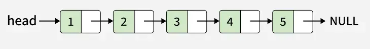
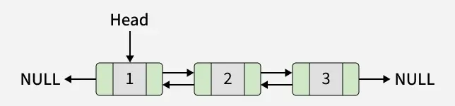
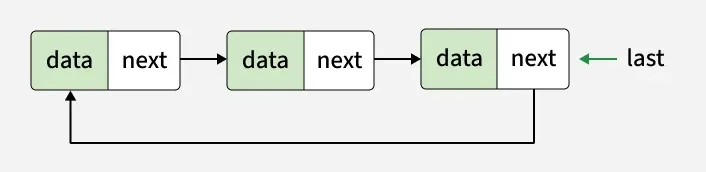
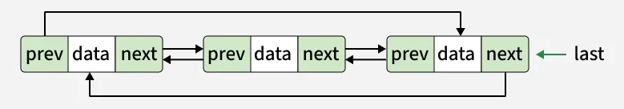

Whenever you have a large set of data and you need to be able to insert and remove stuff somewhere in the middle, a linked list is useful.

1. Singly Linked List

2. Doubly Linked List

3. Circular Singly Linked List

4. Circular Doubly Linked List:
